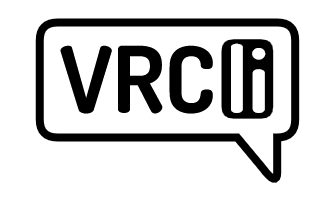

<div align="center">
  
</div>

# vrcli

<div align="center">

[](https://crates.io/crates/vrcli) [](https://crates.io/crates/vrcli) [](LICENSE) [](https://github.com/VRCli/vrcli/actions) [](https://forge.rust-lang.org/infra/channel-releases.html)

</div>

A command-line interface for the VRChat API that lets you manage friends, users, worlds, and authentication directly from your terminal.

## Installation

First, install Rust (https://www.rust-lang.org/tools/install), then:

```powershell
cargo install vrcli
```

## Usage

Set up authentication:

```powershell
vrcli auth login
vrcli auth status
```

General syntax:

```
vrcli <resource> <action> [options]
```

## Commands(Simplified)

### Authentication
- `auth login` - Set authentication credentials
- `auth logout` - Logout and remove stored credentials
- `auth status` - Show current authentication status

### Users
- `users search <query>` - Search users by display name
- `users get <identifier>` - Get user information by ID or display name
  
### Friends
- `friends list` - List all friends with various filtering and sorting options
- `friends get <identifier>` - Get friend details by username
- `friends add <identifier>` - Send a friend request to a user
- `friends remove <identifier>` - Remove a friend or cancel outgoing friend request
- `friends status <identifier>` - Check friend status with a user

### Invites
- `invite send <user> <instance_id>` - Send an invite to a friend
- `invite request <user>` - Request an invite from a friend

### Worlds
- `worlds search <query>` - Search worlds
- `worlds get <world_id>` - Get world information by ID

### Common Options
Most commands support:
- `--id` - Use direct user ID instead of resolving display name
- `--json` - Output in JSON format
- `--long` / `-l` - Show detailed information

## Development

Clone the repo and install dependencies:

```powershell
git clone https://github.com/VRCli/vrcli
cd vrcli
cargo install cargo-husky
```

Standard workflow:

```powershell
# Build and test
cargo build
cargo test

# Format and lint
cargo fmt --all
cargo clippy --all-targets -- -D warnings
```

Pre-commit hooks run automatically via cargo-husky.

## Contributing

Contributions are welcome! Please fork the repo, create a branch, and submit a pull request.

## License

MIT
